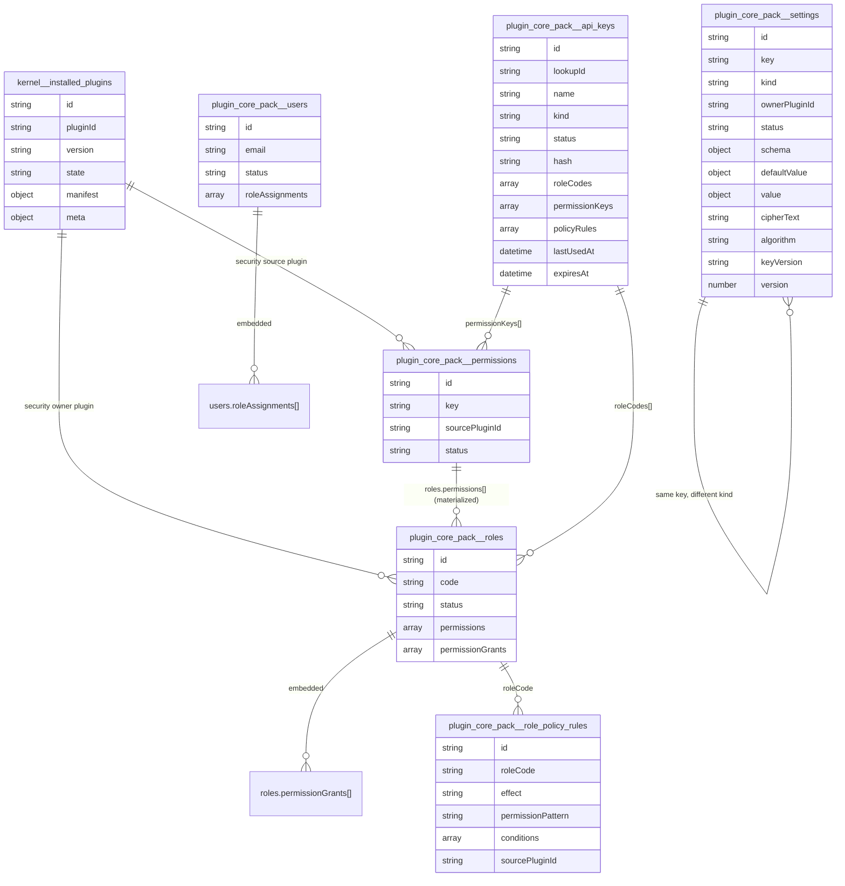

# 0004 - Persistence: EntityRegistry, DbAdapter, Mongo adapter

This chapter explains the persistence layer and the new implications of plugin-contributed security data.

## 1. Canonical entities

`defineEntity(...)` keeps in one place:

- runtime schema
- index metadata

Result:

- one source of truth for both data shape and index policy.

## 2. Plugin namespace isolation

`createPluginDbScope(db, pluginId)` ensures repository operations run inside plugin scope.

Effect:

- logical isolation
- no cross-plugin collisions

## 3. Canonical ID policy

Mongo adapter exposes an app-level `id` for every record:

- `<pluginId>:<entityName>:<storageId>`

`_id` stays storage-internal and is stripped from domain output.

## 4. Atomic updates

`toMongoUpdateDocument(...)` wraps plain patches into `$set`.

Benefit:

- avoids Mongo non-atomic update errors.

## 5. `findOneAndUpdate` compatibility

Adapter handles both driver shapes:

- `{ value: T | null }`
- `T | null`

This keeps repository behavior stable across driver/runtime differences.

## 6. Optional-field normalization

Domain repositories normalize `null` to omitted optional fields (`description`, etc.) before schema parse.

Benefit:

- strict schema consistency.

## 7. Modular RBAC persistence model (updated)

Security-relevant entities:

- `installed_plugins` (kernel namespace, plugin runtime state)
- `permissions` (with `sourcePluginId`)
- `roles` (with `ownerPluginId?`)
- `role_policy_rules` (with `sourcePluginId`)
- `api_keys`
- `users`
- `settings` (single collection with `kind`: `definition` | `value` | `secret`)

Relations are no longer stored in join collections:

- `roles.permissionGrants[]` stores grants with ownership (`sourcePluginId`)
- `users.roleAssignments[]` stores user-role assignments with ownership (`sourcePluginId`)

Why it matters:

- supports independent contributions from multiple plugins
- enables deterministic plugin uninstall/sync

## 8. Legacy permission key compatibility

Permissions repository includes legacy normalization:

- from `users.read` style to canonical namespaced keys when possible

Goal:

- gradual migration without breaking existing read flows.

## 9. Index lifecycle

`ensureIndexes(pluginId, entityNames)` maps logical entity indexes to Mongo `createIndexes`.

## 10. Core-pack Mongo wiring

`core-pack-mongo.module.ts` provides:

- Mongoose connection lifecycle
- `CORE_TOKENS.ENTITY_REGISTRY`
- `CORE_TOKENS.DB_ADAPTER`
- global provider factory for runtime-loaded modules

## 11. Operational invariants

- each entity must be registered before use
- every API-facing record must expose canonical `id`
- `_id` must not leak through controllers
- plugin ownership must be persisted for security entities

## 12. Current Mongo DB diagram (kernel + core-pack)

Reserved namespace `kernel` creates collections with prefix `kernel__`.

Plugin namespace `core-pack` creates collections with prefix `plugin_core_pack__`.



## 13. Operational snapshot: real Mongo document shapes

Example `plugin_core_pack__users`:

```json
{
  "_id": { "$oid": "69a8803edfe9e9eb745057fc" },
  "id": "core-pack:users:69a8803edfe9e9eb745057fc",
  "email": "embedded.1772650558@example.com",
  "displayName": "Embedded User",
  "status": "active",
  "roleAssignments": [
    {
      "roleCode": "admin",
      "sourcePluginId": "core-pack",
      "createdAt": "2026-03-04T18:55:58.041Z",
      "updatedAt": "2026-03-04T18:55:58.041Z"
    }
  ],
  "createdAt": "2026-03-04T18:55:58.020Z",
  "updatedAt": "2026-03-04T18:55:58.041Z"
}
```

Example `plugin_core_pack__roles`:

```json
{
  "_id": { "$oid": "69a8659a7c3f4aa4aeb5f9b0" },
  "id": "core-pack:roles:69a8659a7c3f4aa4aeb5f9b0",
  "code": "admin",
  "name": "Administrator",
  "ownerPluginId": "core-pack",
  "status": "active",
  "permissions": ["core-pack:users:read", "core-pack:users:write"],
  "permissionGrants": [
    {
      "permissionKey": "core-pack:users:read",
      "sourcePluginId": "core-pack",
      "createdAt": "2026-03-04T17:02:18.869Z",
      "updatedAt": "2026-03-04T17:02:18.869Z"
    },
    {
      "permissionKey": "core-pack:users:write",
      "sourcePluginId": "core-pack",
      "createdAt": "2026-03-04T17:02:18.869Z",
      "updatedAt": "2026-03-04T17:02:18.869Z"
    }
  ],
  "createdAt": "2026-03-04T17:02:18.869Z",
  "updatedAt": "2026-03-04T17:02:18.869Z"
}
```

Example `plugin_core_pack__permissions`:

```json
{
  "_id": { "$oid": "69a8659a7c3f4aa4aeb5f9b3" },
  "id": "core-pack:permissions:69a8659a7c3f4aa4aeb5f9b3",
  "key": "core-pack:users:read",
  "displayName": "Read users",
  "sourcePluginId": "core-pack",
  "status": "active",
  "createdAt": "2026-03-04T17:02:18.869Z",
  "updatedAt": "2026-03-04T17:02:18.869Z"
}
```

Example `plugin_core_pack__role_policy_rules`:

```json
{
  "_id": { "$oid": "69a87e3e4777a5dc72378f2c" },
  "id": "core-pack:role_policy_rules:69a87e3e4777a5dc72378f2c",
  "roleCode": "admin",
  "effect": "allow",
  "permissionPattern": "core-pack:users:read",
  "conditions": [],
  "sourcePluginId": "core-pack-manual",
  "createdAt": "2026-03-04T18:47:26.991Z",
  "updatedAt": "2026-03-04T18:47:27.009Z"
}
```

Example `plugin_core_pack__api_keys`:

```json
{
  "_id": { "$oid": "69b000000000000000000010" },
  "id": "core-pack:api_keys:69b000000000000000000010",
  "lookupId": "ak_9p3gk2t7",
  "name": "Backoffice integration",
  "kind": "secret",
  "status": "active",
  "hash": "<sha256>",
  "roleCodes": ["admin"],
  "permissionKeys": ["core-pack:users:read", "core-pack:settings:write"],
  "policyRules": [],
  "lastUsedAt": "2026-03-06T10:00:00.000Z",
  "createdAt": "2026-03-06T09:00:00.000Z",
  "updatedAt": "2026-03-06T10:00:00.000Z"
}
```

Example `kernel__installed_plugins`:

```json
{
  "_id": { "$oid": "69b000000000000000000001" },
  "id": "kernel:installed_plugins:69b000000000000000000001",
  "pluginId": "core-pack",
  "version": "0.1.0",
  "state": "loaded",
  "manifest": {
    "id": "core-pack",
    "capabilities": ["users.service", "settings.service"]
  },
  "meta": {
    "loadedAt": "2026-03-06T09:00:00.000Z"
  },
  "createdAt": "2026-03-06T09:00:00.000Z",
  "updatedAt": "2026-03-06T09:00:00.000Z"
}
```

## 14. Operational playbook: API -> DB impact

### 14.1 `POST /v1/users`

Write path:

1. insert into `plugin_core_pack__users`
2. initialize `roleAssignments` as empty array

Indicative query:

```javascript
db.plugin_core_pack__users.insertOne({
  email: "...",
  displayName: "...",
  status: "active",
  roleAssignments: [],
  createdAt: "...",
  updatedAt: "..."
});
```

### 14.2 `POST /v1/users/:id/roles`

Write path:

1. read user by `id`
2. append assignment to `users.roleAssignments[]`
3. update user `updatedAt`

Indicative query:

```javascript
db.plugin_core_pack__users.updateOne(
  { id: "core-pack:users:..." },
  {
    $set: {
      roleAssignments: [
        {
          roleCode: "admin",
          sourcePluginId: "core-pack",
          createdAt: "...",
          updatedAt: "..."
        }
      ],
      updatedAt: "..."
    }
  }
);
```

### 14.3 `POST /v1/roles` with `permissions[]`

Write path:

1. insert role into `plugin_core_pack__roles`
2. materialize `permissions[]`
3. persist grant ownership in `permissionGrants[]`

### 14.4 `POST /v1/roles/:roleCode/policy-rules`

Write path:

1. insert document into `plugin_core_pack__role_policy_rules`
2. no update on `roles` or `users`

### 14.5 `POST /v1/api-keys`

Write path:

1. generate `lookupId` and the one-time raw secret
2. persist only the secret `hash` in `plugin_core_pack__api_keys`
3. persist `roleCodes[]`, `permissionKeys[]`, and `policyRules[]` as machine-subject authorization material

Note:

- the raw secret is never stored in clear text;
- the client sees it only in the create or rotate response.

### 14.5 `GET /v1/users/:id/permissions`

Read path:

1. read `users.roleAssignments[]`
2. load active roles from `plugin_core_pack__roles`
3. read embedded `roles.permissionGrants[]`
4. validate keys against active records in `plugin_core_pack__permissions`
5. return unique permission key set

## 15. Conclusion

Persistence combines abstraction and operational safety: unified schema declarations, robust Mongo adapter behavior, and first-class support for plugin-contributed security models.

## 16. Kernel runtime store: `installed_plugins` collection

The kernel persists plugin runtime state in a dedicated collection under the `kernel` namespace:

- collection: `kernel__installed_plugins`
- logical key: `pluginId` (unique)
- main fields: `state`, `enabled`, `failureCount`, `disabledReason`, `manifest`, `updatedAt`
- indexes: unique `pluginId`, plus `state`, `enabled`, `updatedAt` desc

Operational value:

- plugin state survives process restarts
- runtime audit and diagnostics
- foundation for an admin plugins console

Current note:

- the starter now writes runtime state into DB (write-side);
- automatic startup rehydration from persisted state can be added as the next step.

## 17. Tabular appendix: collections, ownership, indexes, purpose

| Collection                            | Owner namespace | Key fields                                                                                                                      | Main indexes                                                       | Purpose                                                                                         |
| ------------------------------------- | --------------- | ------------------------------------------------------------------------------------------------------------------------------- | ------------------------------------------------------------------ | ----------------------------------------------------------------------------------------------- |
| `kernel__installed_plugins`           | `kernel`        | `pluginId`, `state`, `enabled`, `failureCount`, `manifest`, `updatedAt`                                                         | unique `pluginId`, plus `state`, `enabled`, `updatedAt` desc       | Persistent runtime state for installed plugins (audit/ops).                                     |
| `plugin_core_pack__users`             | `core-pack`     | `id`, `email`, `status`, `roleAssignments[]`                                                                                    | unique `id`, unique `email`                                        | User registry and embedded role assignments.                                                    |
| `plugin_core_pack__roles`             | `core-pack`     | `id`, `code`, `ownerPluginId`, `permissions[]`, `permissionGrants[]`, `status`                                                  | unique `id`, unique `code`, plus `ownerPluginId`, `status`         | Role catalog and plugin-owned permission grants.                                                |
| `plugin_core_pack__permissions`       | `core-pack`     | `id`, `key`, `sourcePluginId`, `status`                                                                                         | unique `id`, unique `key`, plus `sourcePluginId`, `status`         | Canonical namespaced permission catalog.                                                        |
| `plugin_core_pack__role_policy_rules` | `core-pack`     | `id`, `roleCode`, `effect`, `permissionPattern`, `conditions[]`, `sourcePluginId`                                               | unique `id`, plus `roleCode`, `sourcePluginId`                     | Advanced policy rules (`allow/deny`, wildcard, conditions).                                     |
| `plugin_core_pack__settings`          | `core-pack`     | `id`, `key`, `kind`, `ownerPluginId`, `status`, `schema/defaultValue/value`, `cipherText`, `algorithm`, `keyVersion`, `version` | unique `id`, unique `(kind,key)`, plus `ownerPluginId+kind`, `key` | Unified settings store with logical projections for definitions, values, and encrypted secrets. |

Physical naming note:

- regular plugins still map to Mongo collections using `plugin_<normalizedPluginId>__<entity>`;
- the reserved `kernel` namespace now maps to `kernel__<entity>`;
- the logical runtime namespace is unchanged: the runtime still reasons in terms of `pluginId = "kernel"`.
