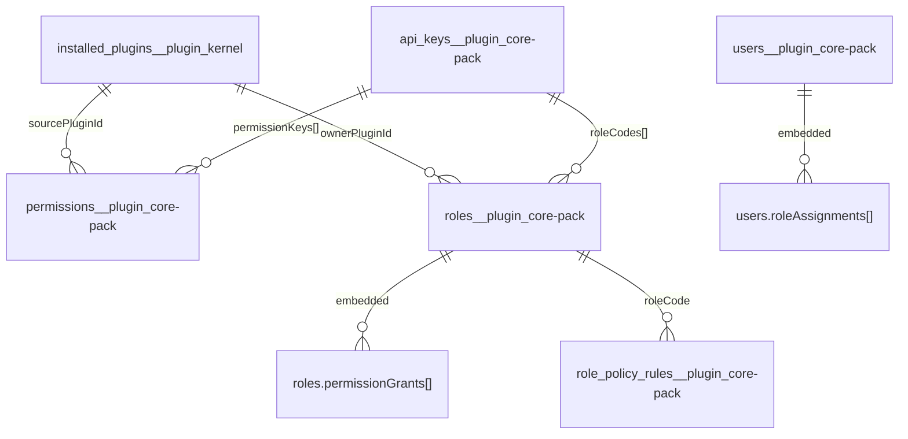

# 0012 - Operational Mongo schema

This document is a quick reference, intended more as an operational schema than a theoretical chapter.

## 1. Physical naming rule

### Kernel namespace

- pattern: `<entity>__plugin_kernel`

Example:

- `installed_plugins__plugin_kernel`

### Regular plugin namespace

- pattern: `<entity>__plugin_<pluginId>`
- optional workspace suffix: `__workspace_<workspaceId>`
- distinct identifiers stay distinct through reversible escaping.

See [collection naming rules](../architecture/plugin-platform/collection-naming.md).

Examples:

- `users__plugin_core-pack`
- `roles__plugin_core-pack`

## 2. Current collection map

| Collection                            | Logical namespace | Logical entity      | Purpose                                         |
| ------------------------------------- | ----------------- | ------------------- | ----------------------------------------------- |
| `installed_plugins__plugin_kernel`           | `kernel`          | `installed_plugins` | persistent runtime state for installed plugins  |
| `users__plugin_core-pack`             | `core-pack`       | `users`             | users and embedded role assignments             |
| `roles__plugin_core-pack`             | `core-pack`       | `roles`             | roles and embedded grants                       |
| `permissions__plugin_core-pack`       | `core-pack`       | `permissions`       | canonical permission catalog                    |
| `role_policy_rules__plugin_core-pack` | `core-pack`       | `role_policy_rules` | advanced policy rules                           |
| `api_keys__plugin_core-pack`          | `core-pack`       | `api_keys`          | machine credentials and attached authz material |
| `settings__plugin_core-pack`          | `core-pack`       | `settings`          | definitions, values, and encrypted secrets      |

## 3. Compact diagram

```mermaid
erDiagram
  "installed_plugins__plugin_kernel" ||--o{ "permissions__plugin_core-pack" : "sourcePluginId"
  "installed_plugins__plugin_kernel" ||--o{ "roles__plugin_core-pack" : "ownerPluginId"
  "users__plugin_core-pack" ||--o{ "users.roleAssignments[]" : "embedded"
  "roles__plugin_core-pack" ||--o{ "roles.permissionGrants[]" : "embedded"
  "roles__plugin_core-pack" ||--o{ "role_policy_rules__plugin_core-pack" : "roleCode"
  "api_keys__plugin_core-pack" ||--o{ "roles__plugin_core-pack" : "roleCodes[]"
  "api_keys__plugin_core-pack" ||--o{ "permissions__plugin_core-pack" : "permissionKeys[]"
```

## 4. Guiding fields by collection

### `installed_plugins__plugin_kernel`

Key fields:

- `id`
- `pluginId`
- `version`
- `state`
- `enabled`
- `failureCount`
- `disabledReason`
- `manifest`
- `updatedAt`

Main indexes:

- unique `pluginId`
- `state`
- `enabled`
- `updatedAt desc`

### `users__plugin_core-pack`

Key fields:

- `id`
- `email`
- `username`
- `status`
- `roleAssignments[]`

Main indexes:

- unique `id`
- unique `email`
- unique `username`

### `roles__plugin_core-pack`

Key fields:

- `id`
- `code`
- `ownerPluginId`
- `status`
- `permissions[]`
- `permissionGrants[]`

Main indexes:

- unique `id`
- unique `code`
- `ownerPluginId`
- `status`

### `permissions__plugin_core-pack`

Key fields:

- `id`
- `key`
- `sourcePluginId`
- `status`

Main indexes:

- unique `id`
- unique `key`
- `sourcePluginId`
- `status`

### `role_policy_rules__plugin_core-pack`

Key fields:

- `id`
- `roleCode`
- `effect`
- `permissionPattern`
- `conditions[]`
- `sourcePluginId`

Main indexes:

- unique `id`
- `roleCode`
- `sourcePluginId`

### `api_keys__plugin_core-pack`

Key fields:

- `id`
- `lookupId`
- `name`
- `kind`
- `status`
- `hash`
- `roleCodes[]`
- `permissionKeys[]`
- `policyRules[]`
- `expiresAt`
- `lastUsedAt`

Main indexes:

- unique `id`
- unique `lookupId`
- `status`
- `kind`
- `expiresAt`

### `settings__plugin_core-pack`

Key fields:

- `id`
- `key`
- `kind`
- `ownerPluginId`
- `status`
- `schema`
- `defaultValue`
- `value`
- `cipherText`
- `algorithm`
- `keyVersion`
- `version`

Main indexes:

- unique `id`
- unique `(kind, key)`
- `ownerPluginId + kind`
- `key`

## 5. Invariants that must not be violated

- `_id` stays storage-internal and must not leak through business APIs
- every record must expose a canonical `id`
- security data must track plugin ownership
- secrets must never be stored in clear text
- join-like relations are materialized as embedded arrays where the model requires it

## 6. Quick debugging map

If a problem concerns:

- plugin runtime state: inspect `installed_plugins__plugin_kernel`
- user role assignments: inspect `users__plugin_core-pack.roleAssignments[]`
- role grants: inspect `roles__plugin_core-pack.permissionGrants[]`
- advanced policies: inspect `role_policy_rules__plugin_core-pack`
- machine integrations: inspect `api_keys__plugin_core-pack`
- plugin configuration: inspect `settings__plugin_core-pack`
