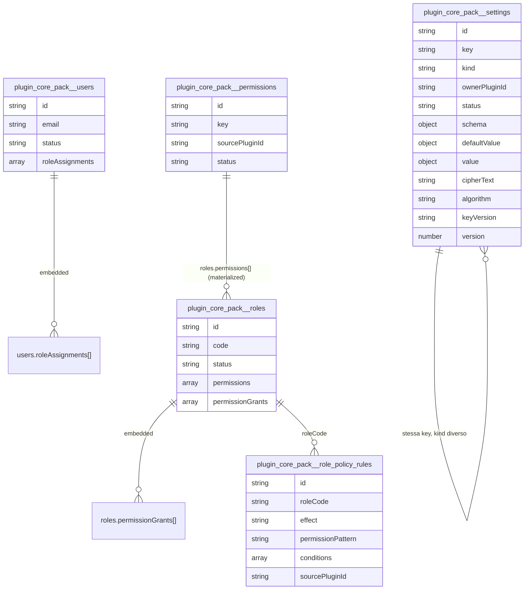

# 0004 - Persistence: EntityRegistry, DbAdapter, Mongo adapter

Questo capitolo descrive il layer persistence e le nuove implicazioni del modello security plugin-contributed.

## 1. Entita canoniche

`defineEntity(...)` unifica:

- schema runtime (`@trinacria/schema`)
- metadati indice

Conseguenza:

- una sola fonte di verita per struttura dati e indicizzazione.

## 2. Isolamento namespace plugin

Con `createPluginDbScope(db, pluginId)` ogni repository opera in namespace plugin.

Effetto:

- collezioni separate logicamente
- nessuna collisione cross-plugin

## 3. Canonical ID

Il Mongo adapter espone sempre `id` applicativo:

- formato: `<pluginId>:<entityName>:<storageId>`

`_id` resta interno storage e viene rimosso dall'output dominio.

## 4. Aggiornamenti atomici

`toMongoUpdateDocument(...)` converte patch plain in `$set`.

Beneficio:

- evita errori `Update document requires atomic operators`.

## 5. Compatibilita `findOneAndUpdate`

L'adapter supporta entrambe le shape driver:

- `{ value: T | null }`
- `T | null`

Questo elimina dipendenze da dettagli di driver/versione.

## 6. Normalizzazione campi opzionali

Repository dominio normalizzano `null` -> campo omesso per campi opzionali (`description`, ecc.).

Beneficio:

- coerenza con schema runtime non-nullable opzionale.

## 7. Modello persistence RBAC modulare (aggiornato)

Entita coinvolte:

- `installed_plugins` (namespace kernel, stato runtime plugin)
- `permissions` (con `sourcePluginId`)
- `roles` (con `ownerPluginId?`)
- `role_policy_rules` (con `sourcePluginId`)
- `users`
- `settings` (collection unica con `kind`: `definition` | `value` | `secret`)

Relazioni non piu su collection di join:

- `roles.permissionGrants[]` contiene i grants con ownership (`sourcePluginId`)
- `users.roleAssignments[]` contiene le assegnazioni ruolo utente con ownership (`sourcePluginId`)

Perche e importante:

- consente contributi indipendenti da plugin diversi
- rende deterministico sync/uninstall per plugin

## 8. Retrocompatibilita key permission

Nel repository permissions esiste normalizzazione legacy:

- da `users.read` verso forma canonical, dove possibile

Scopo:

- migrazione graduale senza bloccare letture API.

## 9. Lifecycle indici

`ensureIndexes(pluginId, entityNames)` traduce gli indici logici in `createIndexes` Mongo.

## 10. Wiring Mongo del core-pack

`core-pack-mongo.module.ts` fornisce:

- connessione Mongoose
- `CORE_TOKENS.ENTITY_REGISTRY`
- `CORE_TOKENS.DB_ADAPTER`
- factory provider globali per runtime loading

## 11. Invarianti operative

- ogni entita deve essere registrata prima dell'uso
- ogni record API-facing deve avere `id` canonico
- `_id` non deve trapelare a livello controller
- ownership plugin deve essere persistita nelle entita security

## 12. Diagramma DB Mongo attuale (core-pack)

Namespace plugin `core-pack` produce collection con prefisso `plugin_core_pack__`.



## 13. Snapshot operativo: documenti Mongo reali (shape)

Esempio `plugin_core_pack__users`:

```json
{
  "_id": { "$oid": "69a8803edfe9e9eb745057fc" },
  "id": "core-pack:users:69a8803edfe9e9eb745057fc",
  "email": "embedded.1772650558@example.com",
  "displayName": "Embedded User",
  "status": "active",
  "roleAssignments": [
    {
      "roleCode": "admin",
      "sourcePluginId": "core-pack",
      "createdAt": "2026-03-04T18:55:58.041Z",
      "updatedAt": "2026-03-04T18:55:58.041Z"
    }
  ],
  "createdAt": "2026-03-04T18:55:58.020Z",
  "updatedAt": "2026-03-04T18:55:58.041Z"
}
```

Esempio `plugin_core_pack__roles`:

```json
{
  "_id": { "$oid": "69a8659a7c3f4aa4aeb5f9b0" },
  "id": "core-pack:roles:69a8659a7c3f4aa4aeb5f9b0",
  "code": "admin",
  "name": "Administrator",
  "ownerPluginId": "core-pack",
  "status": "active",
  "permissions": [
    "core-pack:users:read",
    "core-pack:users:write"
  ],
  "permissionGrants": [
    {
      "permissionKey": "core-pack:users:read",
      "sourcePluginId": "core-pack",
      "createdAt": "2026-03-04T17:02:18.869Z",
      "updatedAt": "2026-03-04T17:02:18.869Z"
    },
    {
      "permissionKey": "core-pack:users:write",
      "sourcePluginId": "core-pack",
      "createdAt": "2026-03-04T17:02:18.869Z",
      "updatedAt": "2026-03-04T17:02:18.869Z"
    }
  ],
  "createdAt": "2026-03-04T17:02:18.869Z",
  "updatedAt": "2026-03-04T17:02:18.869Z"
}
```

Esempio `plugin_core_pack__permissions`:

```json
{
  "_id": { "$oid": "69a8659a7c3f4aa4aeb5f9b3" },
  "id": "core-pack:permissions:69a8659a7c3f4aa4aeb5f9b3",
  "key": "core-pack:users:read",
  "displayName": "Read users",
  "sourcePluginId": "core-pack",
  "status": "active",
  "createdAt": "2026-03-04T17:02:18.869Z",
  "updatedAt": "2026-03-04T17:02:18.869Z"
}
```

Esempio `plugin_core_pack__role_policy_rules`:

```json
{
  "_id": { "$oid": "69a87e3e4777a5dc72378f2c" },
  "id": "core-pack:role_policy_rules:69a87e3e4777a5dc72378f2c",
  "roleCode": "admin",
  "effect": "allow",
  "permissionPattern": "core-pack:users:read",
  "conditions": [],
  "sourcePluginId": "core-pack-manual",
  "createdAt": "2026-03-04T18:47:26.991Z",
  "updatedAt": "2026-03-04T18:47:27.009Z"
}
```

## 14. Playbook operativo: API -> impatto DB

### 14.1 `POST /v1/users`

Write path:

1. insert in `plugin_core_pack__users`
2. `roleAssignments` inizialmente array vuoto

Query indicativa:

```javascript
db.plugin_core_pack__users.insertOne({
  email: "...",
  displayName: "...",
  status: "active",
  roleAssignments: [],
  createdAt: "...",
  updatedAt: "..."
});
```

### 14.2 `POST /v1/users/:id/roles`

Write path:

1. read user by `id`
2. append assignment in `users.roleAssignments[]`
3. update `updatedAt` utente

Query indicativa:

```javascript
db.plugin_core_pack__users.updateOne(
  { id: "core-pack:users:..." },
  {
    $set: {
      roleAssignments: [
        {
          roleCode: "admin",
          sourcePluginId: "core-pack",
          createdAt: "...",
          updatedAt: "..."
        }
      ],
      updatedAt: "..."
    }
  }
);
```

### 14.3 `POST /v1/roles` con `permissions[]`

Write path:

1. insert ruolo in `plugin_core_pack__roles`
2. materializza `permissions[]`
3. persiste ownership grant in `permissionGrants[]`

### 14.4 `POST /v1/roles/:roleCode/policy-rules`

Write path:

1. insert documento in `plugin_core_pack__role_policy_rules`
2. nessun update su `roles` o `users`

### 14.5 `GET /v1/users/:id/permissions`

Read path:

1. legge `users.roleAssignments[]`
2. carica ruoli attivi da `plugin_core_pack__roles`
3. legge `roles.permissionGrants[]` (embedded)
4. valida chiavi su `plugin_core_pack__permissions` attive
5. ritorna set unico di permission key

## 15. Conclusione

Il layer persistence combina astrazione e controllo operativo: schema unificato, adapter Mongo robusto e supporto esplicito ai contributi security modulari.

## 16. Runtime store kernel: collection `installed_plugins`

Il kernel persiste lo stato runtime dei plugin in una collection dedicata nel namespace `kernel`:

- collection: `plugin_kernel__installed_plugins`
- chiave logica: `pluginId` (unique)
- campi principali: `state`, `enabled`, `failureCount`, `disabledReason`, `manifest`, `updatedAt`
- indici: `pluginId` unique, `state`, `enabled`, `updatedAt` desc

Scopo operativo:

- stato plugin persistente tra restart
- audit e diagnostica runtime
- base per pannello amministrativo plugin

Nota attuale:

- lo starter salva/aggiorna lo stato runtime nel DB (write-side);
- la reidratazione automatica dello stato persistito all'avvio puo essere aggiunta come step successivo.

## 17. Appendice tabellare: collection, ownership, indici, scopo

| Collection | Owner namespace | Campi chiave | Indici principali | Scopo |
| --- | --- | --- | --- | --- |
| `plugin_kernel__installed_plugins` | `kernel` | `pluginId`, `state`, `enabled`, `failureCount`, `manifest`, `updatedAt` | `pluginId` unique, `state`, `enabled`, `updatedAt` desc | Persistenza stato runtime plugin installati (audit/ops). |
| `plugin_core_pack__users` | `core-pack` | `id`, `email`, `status`, `roleAssignments[]` | `id` unique, `email` unique | Anagrafica utenti e assegnazioni ruolo embedded. |
| `plugin_core_pack__roles` | `core-pack` | `id`, `code`, `ownerPluginId`, `permissions[]`, `permissionGrants[]`, `status` | `id` unique, `code` unique, `ownerPluginId`, `status` | Catalogo ruoli e contributi permessi plugin-owned. |
| `plugin_core_pack__permissions` | `core-pack` | `id`, `key`, `sourcePluginId`, `status` | `id` unique, `key` unique, `sourcePluginId`, `status` | Catalogo permessi canonici namespaced. |
| `plugin_core_pack__role_policy_rules` | `core-pack` | `id`, `roleCode`, `effect`, `permissionPattern`, `conditions[]`, `sourcePluginId` | `id` unique, `roleCode`, `sourcePluginId` | Regole policy avanzate (`allow/deny`, wildcard, condizioni). |
| `plugin_core_pack__settings` | `core-pack` | `id`, `key`, `kind`, `ownerPluginId`, `status`, `schema/defaultValue/value`, `cipherText`, `algorithm`, `keyVersion`, `version` | `id` unique, `(kind,key)` unique, `ownerPluginId+kind`, `key` | Store settings unificato con proiezioni logiche per definizioni, valori e segreti cifrati. |
