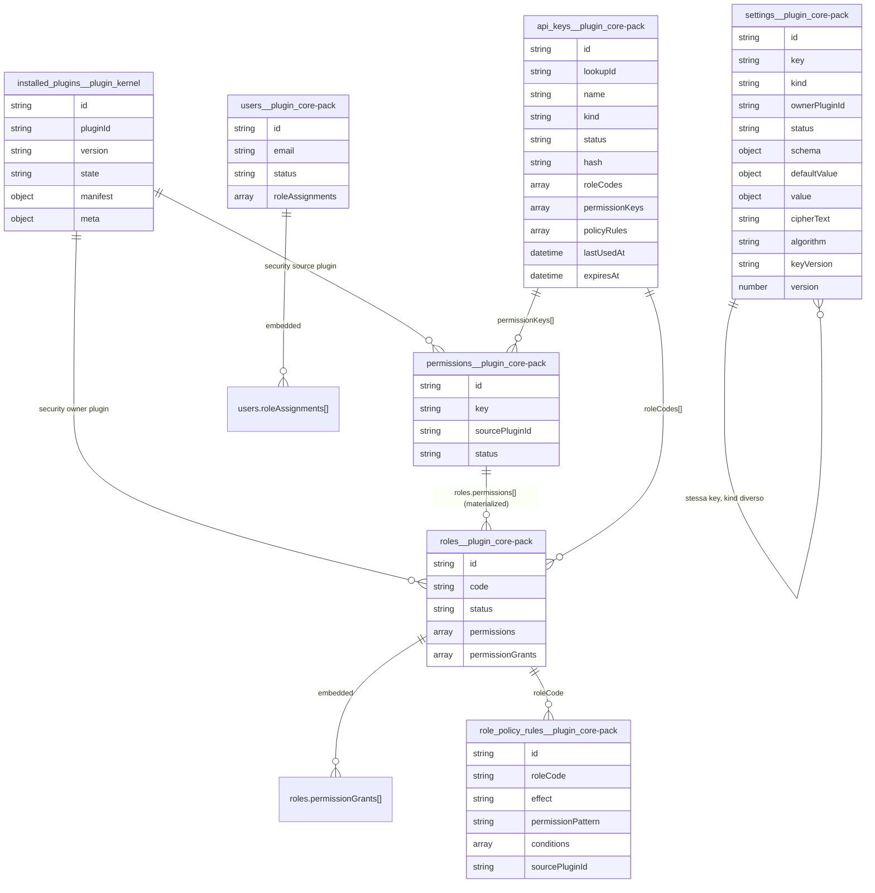

# 0004 - Persistence: EntityRegistry, DbAdapter, Mongo adapter

Storage A0 attuale: `defineEntity` richiede `ownerPluginId`, il registry usa
`get(entityName, ownerPluginId)`. I plugin pubblici usano `context.services.storage`
senza namespace selezionabile. Nomi Mongo leggibili: `<entity>__plugin_<pluginId>`,
con suffisso opzionale `__workspace_<workspaceId>`. Il registro ownership kernel conserva
la tuple `[pluginId, workspaceId ?? null, entityName]` e verifica indici unici su tuple e
nome fisico prima di CRUD e transazioni. I nomi nelle tabelle corrispondono alle collection
attuali; caratteri speciali e separatori nei componenti vengono escapati reversibilmente.
I vecchi layout bloccano lo storage senza modificare dati. Vedi il
[naming delle collection](../architecture/plugin-platform/collection-naming.md).
Vedi [servizi A0](./0007-creare-un-plugin.md#servizi-host-del-plugin-a0-implementato).

Questo capitolo descrive il layer persistence e le nuove implicazioni del modello security plugin-contributed.

## 1. Entita canoniche

`defineEntity(...)` unifica:

- schema runtime (`@trinacria/schema`)
- metadati indice

Conseguenza:

- una sola fonte di verita per struttura dati e indicizzazione.

## 2. Isolamento namespace plugin

Con `createPluginDbScope(db, pluginId)` ogni repository opera in namespace plugin.

Effetto:

- collezioni separate logicamente
- nessuna collisione cross-plugin

## 3. Canonical ID

Il Mongo adapter espone sempre `id` applicativo:

- formato: `<pluginId>:<entityName>:<storageId>`

`_id` resta interno storage e viene rimosso dall'output dominio.

## 4. Aggiornamenti atomici

`toMongoUpdateDocument(...)` converte patch plain in `$set`.

Beneficio:

- evita errori `Update document requires atomic operators`.

## 5. Compatibilita `findOneAndUpdate`

L'adapter supporta entrambe le shape driver:

- `{ value: T | null }`
- `T | null`

Questo elimina dipendenze da dettagli di driver/versione.

## 6. Normalizzazione campi opzionali

Repository dominio normalizzano `null` -> campo omesso per campi opzionali (`description`, ecc.).

Beneficio:

- coerenza con schema runtime non-nullable opzionale.

## 7. Modello persistence RBAC modulare (aggiornato)

Entita coinvolte:

- `installed_plugins` (namespace kernel, stato runtime plugin)
- `permissions` (con `sourcePluginId`)
- `roles` (con `ownerPluginId?`)
- `role_policy_rules` (con `sourcePluginId`)
- `api_keys`
- `users`
- `settings` (collection unica con `kind`: `definition` | `value` | `secret`)

Relazioni non piu su collection di join:

- `roles.permissionGrants[]` contiene i grants con ownership (`sourcePluginId`)
- `users.roleAssignments[]` contiene le assegnazioni ruolo utente con ownership (`sourcePluginId`)

Perche e importante:

- consente contributi indipendenti da plugin diversi
- rende deterministico sync/uninstall per plugin

## 8. Retrocompatibilita key permission

Nel repository permissions esiste normalizzazione legacy:

- da `users.read` verso forma canonical, dove possibile

Scopo:

- migrazione graduale senza bloccare letture API.

## 9. Lifecycle indici

`ensureIndexes(pluginId, entityNames)` traduce gli indici logici in `createIndexes` Mongo.

## 10. Wiring Mongo del core-pack

`core-pack-mongo.module.ts` fornisce:

- connessione Mongoose
- `CORE_TOKENS.ENTITY_REGISTRY`
- `CORE_TOKENS.DB_ADAPTER`
- factory provider globali per runtime loading

## 11. Invarianti operative

- ogni entita deve essere registrata prima dell'uso
- ogni record API-facing deve avere `id` canonico
- `_id` non deve trapelare a livello controller
- ownership plugin deve essere persistita nelle entita security

## 12. Diagramma DB Mongo attuale (kernel + core-pack)

Namespace riservato `kernel` produce collection con prefisso `kernel__`.

Namespace plugin `core-pack` produce collection con prefisso `plugin_core_pack__`.


```mermaid
erDiagram
  "installed_plugins__plugin_kernel" ||--o{ "permissions__plugin_core-pack" : "security source plugin"
  "installed_plugins__plugin_kernel" ||--o{ "roles__plugin_core-pack" : "security owner plugin"
  "users__plugin_core-pack" ||--o{ "users.roleAssignments[]" : "embedded"
  "roles__plugin_core-pack" ||--o{ "roles.permissionGrants[]" : "embedded"
  "roles__plugin_core-pack" ||--o{ "role_policy_rules__plugin_core-pack" : "roleCode"
  "permissions__plugin_core-pack" ||--o{ "roles__plugin_core-pack" : "roles.permissions[] (materialized)"
  "api_keys__plugin_core-pack" ||--o{ "roles__plugin_core-pack" : "roleCodes[]"
  "api_keys__plugin_core-pack" ||--o{ "permissions__plugin_core-pack" : "permissionKeys[]"
  "settings__plugin_core-pack" ||--o{ "settings__plugin_core-pack" : "stessa key, kind diverso"

  "installed_plugins__plugin_kernel" {
    string id
    string pluginId
    string version
    string state
    object manifest
    object meta
  }

  "users__plugin_core-pack" {
    string id
    string email
    string status
    array roleAssignments
  }

  "roles__plugin_core-pack" {
    string id
    string code
    string status
    array permissions
    array permissionGrants
  }

  "permissions__plugin_core-pack" {
    string id
    string key
    string sourcePluginId
    string status
  }

  "role_policy_rules__plugin_core-pack" {
    string id
    string roleCode
    string effect
    string permissionPattern
    array conditions
    string sourcePluginId
  }

  "api_keys__plugin_core-pack" {
    string id
    string lookupId
    string name
    string kind
    string status
    string hash
    array roleCodes
    array permissionKeys
    array policyRules
    datetime lastUsedAt
    datetime expiresAt
  }

  "settings__plugin_core-pack" {
    string id
    string key
    string kind
    string ownerPluginId
    string status
    object schema
    object defaultValue
    object value
    string cipherText
    string algorithm
    string keyVersion
    number version
  }
```

## 13. Snapshot operativo: documenti Mongo reali (shape)

Esempio `users__plugin_core-pack`:

```json
{
  "_id": { "$oid": "69a8803edfe9e9eb745057fc" },
  "id": "core-pack:users:69a8803edfe9e9eb745057fc",
  "email": "embedded.1772650558@example.com",
  "displayName": "Embedded User",
  "status": "active",
  "roleAssignments": [
    {
      "roleCode": "admin",
      "sourcePluginId": "core-pack",
      "createdAt": "2026-03-04T18:55:58.041Z",
      "updatedAt": "2026-03-04T18:55:58.041Z"
    }
  ],
  "createdAt": "2026-03-04T18:55:58.020Z",
  "updatedAt": "2026-03-04T18:55:58.041Z"
}
```

Esempio `roles__plugin_core-pack`:

```json
{
  "_id": { "$oid": "69a8659a7c3f4aa4aeb5f9b0" },
  "id": "core-pack:roles:69a8659a7c3f4aa4aeb5f9b0",
  "code": "admin",
  "name": "Administrator",
  "ownerPluginId": "core-pack",
  "status": "active",
  "permissions": ["core-pack:users:read", "core-pack:users:write"],
  "permissionGrants": [
    {
      "permissionKey": "core-pack:users:read",
      "sourcePluginId": "core-pack",
      "createdAt": "2026-03-04T17:02:18.869Z",
      "updatedAt": "2026-03-04T17:02:18.869Z"
    },
    {
      "permissionKey": "core-pack:users:write",
      "sourcePluginId": "core-pack",
      "createdAt": "2026-03-04T17:02:18.869Z",
      "updatedAt": "2026-03-04T17:02:18.869Z"
    }
  ],
  "createdAt": "2026-03-04T17:02:18.869Z",
  "updatedAt": "2026-03-04T17:02:18.869Z"
}
```

Esempio `permissions__plugin_core-pack`:

```json
{
  "_id": { "$oid": "69a8659a7c3f4aa4aeb5f9b3" },
  "id": "core-pack:permissions:69a8659a7c3f4aa4aeb5f9b3",
  "key": "core-pack:users:read",
  "displayName": "Read users",
  "sourcePluginId": "core-pack",
  "status": "active",
  "createdAt": "2026-03-04T17:02:18.869Z",
  "updatedAt": "2026-03-04T17:02:18.869Z"
}
```

Esempio `role_policy_rules__plugin_core-pack`:

```json
{
  "_id": { "$oid": "69a87e3e4777a5dc72378f2c" },
  "id": "core-pack:role_policy_rules:69a87e3e4777a5dc72378f2c",
  "roleCode": "admin",
  "effect": "allow",
  "permissionPattern": "core-pack:users:read",
  "conditions": [],
  "sourcePluginId": "core-pack-manual",
  "createdAt": "2026-03-04T18:47:26.991Z",
  "updatedAt": "2026-03-04T18:47:27.009Z"
}
```

Esempio `api_keys__plugin_core-pack`:

```json
{
  "_id": { "$oid": "69b000000000000000000010" },
  "id": "core-pack:api_keys:69b000000000000000000010",
  "lookupId": "ak_9p3gk2t7",
  "name": "Backoffice integration",
  "kind": "secret",
  "status": "active",
  "hash": "<sha256>",
  "roleCodes": ["admin"],
  "permissionKeys": ["core-pack:users:read", "core-pack:settings:write"],
  "policyRules": [],
  "lastUsedAt": "2026-03-06T10:00:00.000Z",
  "createdAt": "2026-03-06T09:00:00.000Z",
  "updatedAt": "2026-03-06T10:00:00.000Z"
}
```

Esempio `installed_plugins__plugin_kernel`:

```json
{
  "_id": { "$oid": "69b000000000000000000001" },
  "id": "kernel:installed_plugins:69b000000000000000000001",
  "pluginId": "core-pack",
  "version": "0.1.0",
  "state": "loaded",
  "manifest": {
    "id": "core-pack",
    "capabilities": ["users.service", "settings.service"]
  },
  "meta": {
    "loadedAt": "2026-03-06T09:00:00.000Z"
  },
  "createdAt": "2026-03-06T09:00:00.000Z",
  "updatedAt": "2026-03-06T09:00:00.000Z"
}
```

## 14. Playbook operativo: API -> impatto DB

### 14.1 `POST /v1/users`

Write path:

1. insert in `users__plugin_core-pack`
2. `roleAssignments` inizialmente array vuoto

Query indicativa:

```javascript
db.users__plugin_core-pack.insertOne({
  email: "...",
  displayName: "...",
  status: "active",
  roleAssignments: [],
  createdAt: "...",
  updatedAt: "..."
});
```

### 14.2 `POST /v1/users/:id/roles`

Write path:

1. read user by `id`
2. append assignment in `users.roleAssignments[]`
3. update `updatedAt` utente

Query indicativa:

```javascript
db.users__plugin_core-pack.updateOne(
  { id: "core-pack:users:..." },
  {
    $set: {
      roleAssignments: [
        {
          roleCode: "admin",
          sourcePluginId: "core-pack",
          createdAt: "...",
          updatedAt: "..."
        }
      ],
      updatedAt: "..."
    }
  }
);
```

### 14.3 `POST /v1/roles` con `permissions[]`

Write path:

1. insert ruolo in `roles__plugin_core-pack`
2. materializza `permissions[]`
3. persiste ownership grant in `permissionGrants[]`

### 14.4 `POST /v1/roles/:roleCode/policy-rules`

Write path:

1. insert documento in `role_policy_rules__plugin_core-pack`
2. nessun update su `roles` o `users`

### 14.5 `POST /v1/api-keys`

Write path:

1. genera `lookupId` e secret raw one-shot
2. salva solo `hash` del secret in `api_keys__plugin_core-pack`
3. persiste `roleCodes[]`, `permissionKeys[]` e `policyRules[]` come materiale authz del caller macchina

Nota:

- il secret raw non viene mai salvato in chiaro;
- il client lo vede solo nella response di creazione o rotate.

### 14.5 `GET /v1/users/:id/permissions`

Read path:

1. legge `users.roleAssignments[]`
2. carica ruoli attivi da `roles__plugin_core-pack`
3. legge `roles.permissionGrants[]` (embedded)
4. valida chiavi su `permissions__plugin_core-pack` attive
5. ritorna set unico di permission key

## 15. Conclusione

Il layer persistence combina astrazione e controllo operativo: schema unificato, adapter Mongo robusto e supporto esplicito ai contributi security modulari.

## 16. Runtime store kernel: collection `installed_plugins`

Il kernel persiste lo stato runtime dei plugin in una collection dedicata nel namespace `kernel`:

- collection: `installed_plugins__plugin_kernel`
- chiave logica: `pluginId` (unique)
- campi principali: `state`, `enabled`, `failureCount`, `disabledReason`, `manifest`, `updatedAt`
- indici: `pluginId` unique, `state`, `enabled`, `updatedAt` desc

Scopo operativo:

- stato plugin persistente tra restart
- audit e diagnostica runtime
- base per pannello amministrativo plugin

Nota attuale:

- lo starter salva/aggiorna lo stato runtime nel DB (write-side);
- la reidratazione automatica dello stato persistito all'avvio puo essere aggiunta come step successivo.

## 17. Appendice tabellare: collection, ownership, indici, scopo

| Collection                            | Owner namespace | Campi chiave                                                                                                                    | Indici principali                                             | Scopo                                                                                      |
| ------------------------------------- | --------------- | ------------------------------------------------------------------------------------------------------------------------------- | ------------------------------------------------------------- | ------------------------------------------------------------------------------------------ |
| `installed_plugins__plugin_kernel`           | `kernel`        | `pluginId`, `state`, `enabled`, `failureCount`, `manifest`, `updatedAt`                                                         | `pluginId` unique, `state`, `enabled`, `updatedAt` desc       | Persistenza stato runtime plugin installati (audit/ops).                                   |
| `users__plugin_core-pack`             | `core-pack`     | `id`, `email`, `status`, `roleAssignments[]`                                                                                    | `id` unique, `email` unique                                   | Anagrafica utenti e assegnazioni ruolo embedded.                                           |
| `roles__plugin_core-pack`             | `core-pack`     | `id`, `code`, `ownerPluginId`, `permissions[]`, `permissionGrants[]`, `status`                                                  | `id` unique, `code` unique, `ownerPluginId`, `status`         | Catalogo ruoli e contributi permessi plugin-owned.                                         |
| `permissions__plugin_core-pack`       | `core-pack`     | `id`, `key`, `sourcePluginId`, `status`                                                                                         | `id` unique, `key` unique, `sourcePluginId`, `status`         | Catalogo permessi canonici namespaced.                                                     |
| `role_policy_rules__plugin_core-pack` | `core-pack`     | `id`, `roleCode`, `effect`, `permissionPattern`, `conditions[]`, `sourcePluginId`                                               | `id` unique, `roleCode`, `sourcePluginId`                     | Regole policy avanzate (`allow/deny`, wildcard, condizioni).                               |
| `settings__plugin_core-pack`          | `core-pack`     | `id`, `key`, `kind`, `ownerPluginId`, `status`, `schema/defaultValue/value`, `cipherText`, `algorithm`, `keyVersion`, `version` | `id` unique, `(kind,key)` unique, `ownerPluginId+kind`, `key` | Store settings unificato con proiezioni logiche per definizioni, valori e segreti cifrati. |

Nota sul naming fisico attuale (A0):

- kernel e plugin usano `<entity>__plugin_<pluginId>`, con eventuale workspace;
- il registro ownership conserva owner/workspace/entityName leggibili e verifica due indici unici;
- il namespace logico resta `pluginId = "kernel"` per l'infrastruttura riservata all'host;
- caratteri riservati e underscore doppi sono escapati senza normalizzazione lossy;
- i vecchi layout richiedono una migrazione esplicita; non esiste fallback automatico.
