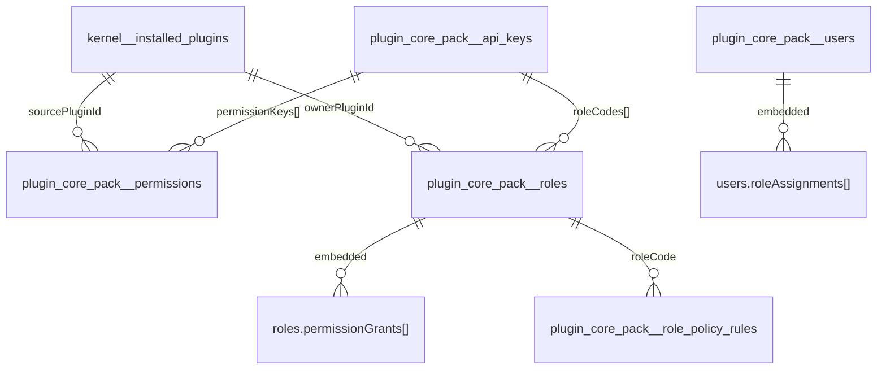

# 0012 - Schema Mongo operativo

Questo documento e un riferimento rapido, pensato piu come schema operativo che come capitolo teorico.

## 1. Regola di naming fisico

### Namespace kernel

- pattern: `kernel__<entity>`

Esempio:

- `kernel__installed_plugins`

### Namespace plugin normale

- pattern: `plugin_<pluginId_normalized>__<entity>`

Esempio:

- `plugin_core_pack__users`
- `plugin_core_pack__roles`

## 2. Mappa collection attuale

| Collection | Namespace logico | Entita logica | Scopo |
| --- | --- | --- | --- |
| `kernel__installed_plugins` | `kernel` | `installed_plugins` | stato runtime persistente dei plugin installati |
| `plugin_core_pack__users` | `core-pack` | `users` | utenti e assegnazioni ruolo embedded |
| `plugin_core_pack__roles` | `core-pack` | `roles` | ruoli e grant embedded |
| `plugin_core_pack__permissions` | `core-pack` | `permissions` | catalogo permessi canonici |
| `plugin_core_pack__role_policy_rules` | `core-pack` | `role_policy_rules` | policy rules avanzate |
| `plugin_core_pack__api_keys` | `core-pack` | `api_keys` | credenziali macchina e materiale authz associato |
| `plugin_core_pack__settings` | `core-pack` | `settings` | definizioni, valori e segreti cifrati |

## 3. Diagramma compatto

## 4. Campi guida per collection

### `kernel__installed_plugins`

Campi chiave:

- `id`
- `pluginId`
- `version`
- `state`
- `enabled`
- `failureCount`
- `disabledReason`
- `manifest`
- `updatedAt`

Indici principali:

- unique `pluginId`
- `state`
- `enabled`
- `updatedAt desc`

### `plugin_core_pack__users`

Campi chiave:

- `id`
- `email`
- `username`
- `status`
- `roleAssignments[]`

Indici principali:

- unique `id`
- unique `email`
- unique `username`

### `plugin_core_pack__roles`

Campi chiave:

- `id`
- `code`
- `ownerPluginId`
- `status`
- `permissions[]`
- `permissionGrants[]`

Indici principali:

- unique `id`
- unique `code`
- `ownerPluginId`
- `status`

### `plugin_core_pack__permissions`

Campi chiave:

- `id`
- `key`
- `sourcePluginId`
- `status`

Indici principali:

- unique `id`
- unique `key`
- `sourcePluginId`
- `status`

### `plugin_core_pack__role_policy_rules`

Campi chiave:

- `id`
- `roleCode`
- `effect`
- `permissionPattern`
- `conditions[]`
- `sourcePluginId`

Indici principali:

- unique `id`
- `roleCode`
- `sourcePluginId`

### `plugin_core_pack__api_keys`

Campi chiave:

- `id`
- `lookupId`
- `name`
- `kind`
- `status`
- `hash`
- `roleCodes[]`
- `permissionKeys[]`
- `policyRules[]`
- `expiresAt`
- `lastUsedAt`

Indici principali:

- unique `id`
- unique `lookupId`
- `status`
- `kind`
- `expiresAt`

### `plugin_core_pack__settings`

Campi chiave:

- `id`
- `key`
- `kind`
- `ownerPluginId`
- `status`
- `schema`
- `defaultValue`
- `value`
- `cipherText`
- `algorithm`
- `keyVersion`
- `version`

Indici principali:

- unique `id`
- unique `(kind, key)`
- `ownerPluginId + kind`
- `key`

## 5. Invarianti da non violare

- `_id` resta storage-internal e non deve uscire nelle API business
- ogni record deve avere `id` canonico
- i dati security devono tracciare ownership plugin
- i secret non devono mai essere persistiti in chiaro
- le relazioni di join vengono materializzate come array embedded dove previsto dal modello

## 6. Lettura rapida per debugging

Se un problema riguarda:

- runtime plugin: controlla `kernel__installed_plugins`
- assegnazioni ruolo utente: controlla `plugin_core_pack__users.roleAssignments[]`
- grant ruolo: controlla `plugin_core_pack__roles.permissionGrants[]`
- policy avanzate: controlla `plugin_core_pack__role_policy_rules`
- integrazioni macchina: controlla `plugin_core_pack__api_keys`
- configurazione plugin: controlla `plugin_core_pack__settings`
