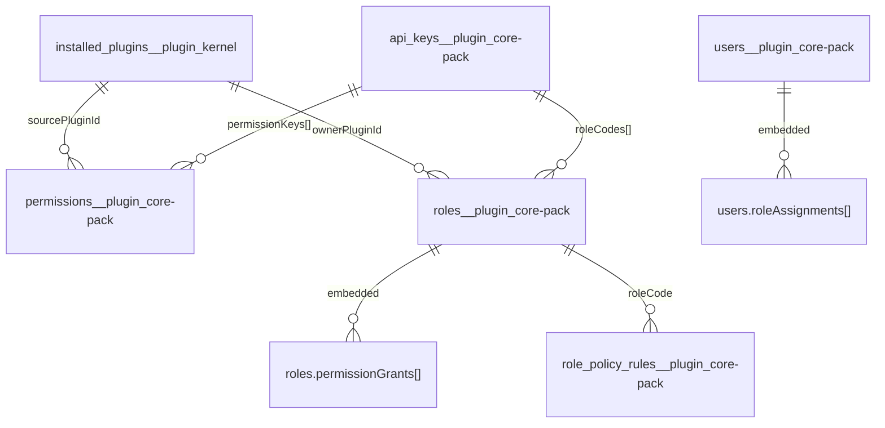

# 0012 - Schema Mongo operativo

Questo documento e un riferimento rapido, pensato piu come schema operativo che come capitolo teorico.

## 1. Regola di naming fisico

### Namespace kernel

- pattern: `<entity>__plugin_kernel`

Esempio:

- `installed_plugins__plugin_kernel`

### Namespace plugin normale

- pattern: `<entity>__plugin_<pluginId>`
- workspace opzionale: `__workspace_<workspaceId>`
- identificatori distinti restano distinti, senza normalizzazione lossy.

Vedi [regole di escaping e esempi](../architecture/plugin-platform/collection-naming.md).

Esempio:

- `users__plugin_core-pack`
- `roles__plugin_core-pack`

## 2. Mappa collection attuale

| Collection                            | Namespace logico | Entita logica       | Scopo                                            |
| ------------------------------------- | ---------------- | ------------------- | ------------------------------------------------ |
| `installed_plugins__plugin_kernel`           | `kernel`         | `installed_plugins` | stato runtime persistente dei plugin installati  |
| `users__plugin_core-pack`             | `core-pack`      | `users`             | utenti e assegnazioni ruolo embedded             |
| `roles__plugin_core-pack`             | `core-pack`      | `roles`             | ruoli e grant embedded                           |
| `permissions__plugin_core-pack`       | `core-pack`      | `permissions`       | catalogo permessi canonici                       |
| `role_policy_rules__plugin_core-pack` | `core-pack`      | `role_policy_rules` | policy rules avanzate                            |
| `api_keys__plugin_core-pack`          | `core-pack`      | `api_keys`          | credenziali macchina e materiale authz associato |
| `settings__plugin_core-pack`          | `core-pack`      | `settings`          | definizioni, valori e segreti cifrati            |

## 3. Diagramma compatto

```mermaid
erDiagram
  "installed_plugins__plugin_kernel" ||--o{ "permissions__plugin_core-pack" : "sourcePluginId"
  "installed_plugins__plugin_kernel" ||--o{ "roles__plugin_core-pack" : "ownerPluginId"
  "users__plugin_core-pack" ||--o{ "users.roleAssignments[]" : "embedded"
  "roles__plugin_core-pack" ||--o{ "roles.permissionGrants[]" : "embedded"
  "roles__plugin_core-pack" ||--o{ "role_policy_rules__plugin_core-pack" : "roleCode"
  "api_keys__plugin_core-pack" ||--o{ "roles__plugin_core-pack" : "roleCodes[]"
  "api_keys__plugin_core-pack" ||--o{ "permissions__plugin_core-pack" : "permissionKeys[]"
```

## 4. Campi guida per collection

### `installed_plugins__plugin_kernel`

Campi chiave:

- `id`
- `pluginId`
- `version`
- `state`
- `enabled`
- `failureCount`
- `disabledReason`
- `manifest`
- `updatedAt`

Indici principali:

- unique `pluginId`
- `state`
- `enabled`
- `updatedAt desc`

### `users__plugin_core-pack`

Campi chiave:

- `id`
- `email`
- `username`
- `status`
- `roleAssignments[]`

Indici principali:

- unique `id`
- unique `email`
- unique `username`

### `roles__plugin_core-pack`

Campi chiave:

- `id`
- `code`
- `ownerPluginId`
- `status`
- `permissions[]`
- `permissionGrants[]`

Indici principali:

- unique `id`
- unique `code`
- `ownerPluginId`
- `status`

### `permissions__plugin_core-pack`

Campi chiave:

- `id`
- `key`
- `sourcePluginId`
- `status`

Indici principali:

- unique `id`
- unique `key`
- `sourcePluginId`
- `status`

### `role_policy_rules__plugin_core-pack`

Campi chiave:

- `id`
- `roleCode`
- `effect`
- `permissionPattern`
- `conditions[]`
- `sourcePluginId`

Indici principali:

- unique `id`
- `roleCode`
- `sourcePluginId`

### `api_keys__plugin_core-pack`

Campi chiave:

- `id`
- `lookupId`
- `name`
- `kind`
- `status`
- `hash`
- `roleCodes[]`
- `permissionKeys[]`
- `policyRules[]`
- `expiresAt`
- `lastUsedAt`

Indici principali:

- unique `id`
- unique `lookupId`
- `status`
- `kind`
- `expiresAt`

### `settings__plugin_core-pack`

Campi chiave:

- `id`
- `key`
- `kind`
- `ownerPluginId`
- `status`
- `schema`
- `defaultValue`
- `value`
- `cipherText`
- `algorithm`
- `keyVersion`
- `version`

Indici principali:

- unique `id`
- unique `(kind, key)`
- `ownerPluginId + kind`
- `key`

## 5. Invarianti da non violare

- `_id` resta storage-internal e non deve uscire nelle API business
- ogni record deve avere `id` canonico
- i dati security devono tracciare ownership plugin
- i secret non devono mai essere persistiti in chiaro
- le relazioni di join vengono materializzate come array embedded dove previsto dal modello

## 6. Lettura rapida per debugging

Se un problema riguarda:

- runtime plugin: controlla `installed_plugins__plugin_kernel`
- assegnazioni ruolo utente: controlla `users__plugin_core-pack.roleAssignments[]`
- grant ruolo: controlla `roles__plugin_core-pack.permissionGrants[]`
- policy avanzate: controlla `role_policy_rules__plugin_core-pack`
- integrazioni macchina: controlla `api_keys__plugin_core-pack`
- configurazione plugin: controlla `settings__plugin_core-pack`
